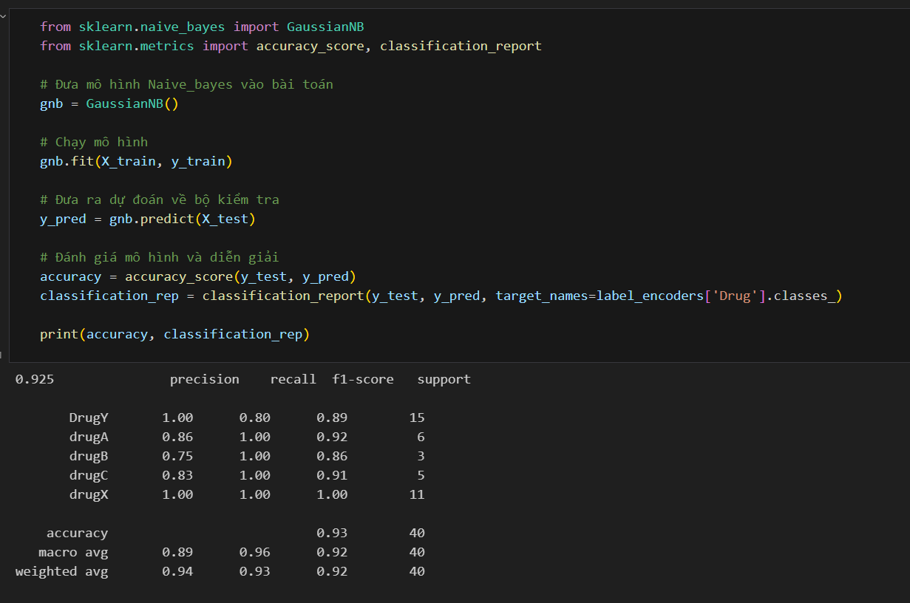

# LAB 2
# Câu 1
1. Công nghệ sử dụng
    Sử dụng thư viện: pandas, numpy, sklearn.

2. Thuật toán sử dụng
    Naive Bayes

3. Kết quả:
    
)

4. So sánh kết quả.
    
)
    Ta thấy kết quả của Multinomial cao hơn so với Bernoulli    

# Câu 2
1. Công nghệ sử dụng: 
    pandas, sklearn.

2. Thuật toán sử dụng:
    Naive_bayes

3. Kết quả:
    
