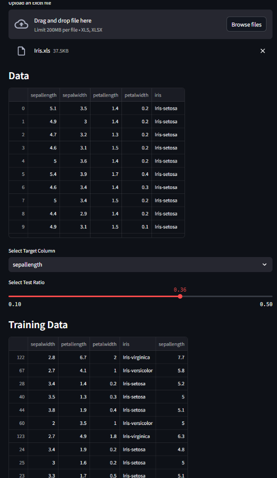
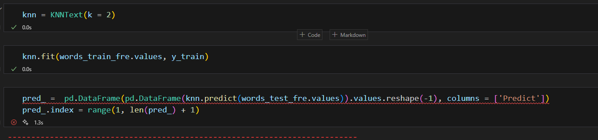
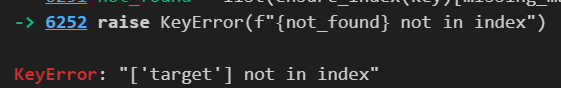

# LAB 3
# Câu 1 (Centroid_pratice)
1. Công nghệ sử dụng
    Sử dụng thư viện: pandas, numpy, sklearn.

2. Thuật toán sử dụng
    KNN Cơ bản: dự đoán nhãn dựa trên Euclid và giá trị trung bình của lớp train

3. Kết quả:
    
)

# Câu 2
1. Công nghệ sử dụng: 
    pandas, sklearn, numpy

2. Thuật toán sử dụng:
    KNN: phân loại dựa trên tìm kiếm
    Tính khoảng cách dựa trên tương đồng của các văn bản
    One-hot Encoding: các văn bản chuyển thành Bag of Words, sau đó đếm số lần xuất hiện, tạo ra 1 ma trận tần xuất.

3. Kết quả:
    
    
    Do không tìm được lỗi nên em chụp tạm 

# Câu 3
1. Công nghệ sử dụng: 
    pandas, sklearn, numpy

2. Thuật toán sử dụng:
    KNN: Dự đoán nhãn dựa trên khoảng cách 
    Tính khoảng cách giữa các không gian vector
    chuyển các giá trị về 0,1

3. Kết quả:
    
    
    Do không tìm được lỗi nên em chụp tạm 